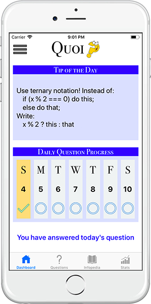
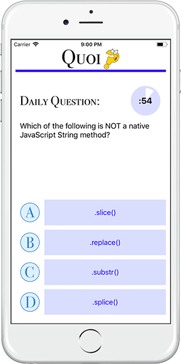
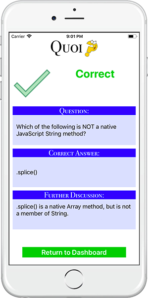
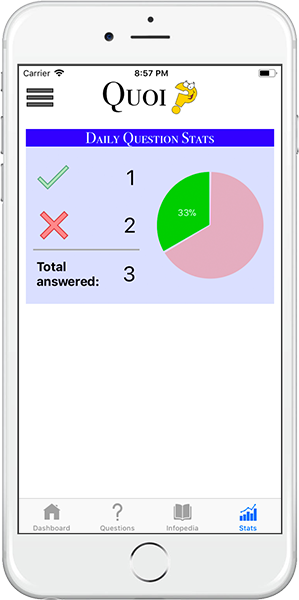
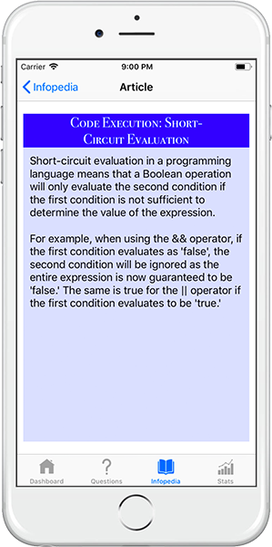

# Quoi iOS Client
> Swift iOS app developed in Xcode for Quoi, my Galvanize Capstone project.

Quoi is a quiz app with a twist! It challenges you to answer a daily question in 60 seconds or less, and then helps you track your progress, review prior questions, and brush up on related topics.

Differentiating features:
* Low barrier to entry: just take on one question a day!
* Feedback loop: collects user feedback on quality of questions

## Screenshots

## Demo Video
[Quoi Demo](https://youtu.be/nAdBttTeWoI)

## Installation
1. pod install