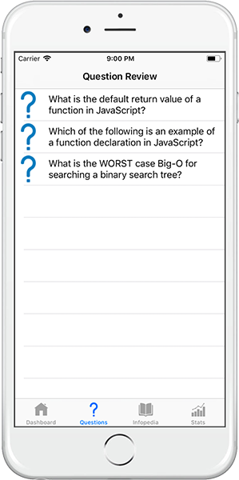

# Quoi iOS Client
> Swift iOS app developed in Xcode for Quoi, my Galvanize Capstone project.

Quoi is a quiz app with a twist! It challenges you to answer a daily question in 60 seconds or less, and then helps you track your progress, review prior questions, and brush up on related topics.

Differentiating features:
* Low barrier to entry: just take on one question a day!
* Feedback loop: collects user feedback on quality of questions

### A Couple Notes On Quoi Methodology
* The [Quoi backend](https://github.com/KevinUSCU/quoi-server) automatically pulls a new daily question and daily tip (the question and tip pulled are done so at random from the pool, but are the same on a given day for all users) from it's database every day. It will not recycle and repeat any of the same questions or tips until the entire stack has been exhausted.
* I like the idea of being able to go back and review old questions, but I wanted the user to experience a new question for the first time in the daily question interface. Therefore, the Questions tab only shows questions that have already appeared for, and been attempted by, that user as daily questions.

## Screenshots

## Demo Video
[Quoi Demo](https://youtu.be/YHHOteOeDsE)

## Installation
1. Requires Xcode and Cocoapods to be installed.
2. From the project directory, run 'pod install'
